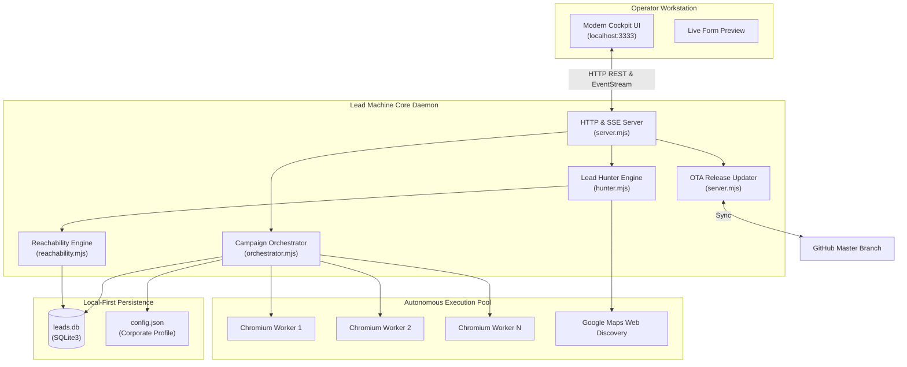

# Lead Machine Enterprise Edition

> Autonomous B2B Lead Discovery, Reachability Validation, and High-Throughput Form Outreach Engine.

[](https://github.com/leadmachine-core/LeadMachine)
[](LICENSE)
[](https://nodejs.org/)
[]()
[]()

---

## Executive Overview

**Lead Machine** is a local-first enterprise software engine engineered for high-velocity outbound pipeline development. It unifies automated local lead discovery, pre-flight domain reachability diagnostics, deep contact-form heuristics, and multi-threaded stealth submission into a unified real-time cockpit.

Unlike cloud SaaS platforms that gate data behind recurring fees and shared scraping quotas, Lead Machine runs directly on your hardware with complete data sovereignty: every lead, corporate profile, and outreach record stays strictly within your local SQLite database.

```
┌─────────────────────────────────────────────────────────────────────────────┐
│                            LEAD MACHINE v2.2.0                              │
│                         Enterprise Mission Cockpit                          │
├───────────────────────┬─────────────────────────────┬───────────────────────┤
│    [1] LEAD HUNTER    │     [2] OUTREACH ENGINE     │    [3] CRM & DATA     │
│  State & Niche Mining │   Multi-Worker Automation   │ SQLite Lead Records   │
│  Stealth Google Maps  │   Humanized Form Fills      │ Reachability Filter   │
│  Reachability Check   │   Real-Time SSE Telemetry   │ 1-Click CSV Export    │
└───────────────────────┴─────────────────────────────┴───────────────────────┘
```

---

## ⚡ Instant One-Line Installation

Deploy Lead Machine to any Windows workstation or virtual machine in seconds. The automated installer checks your system, provisions runtime binaries, initializes the database, configures background services, and creates a desktop launch shortcut.

### Windows (PowerShell)

Open PowerShell and execute:

```powershell
irm https://raw.githubusercontent.com/leadmachine-core/installer/main/install.ps1 | iex
```

### macOS & Linux (Terminal)

```bash
curl -fsSL https://raw.githubusercontent.com/leadmachine-core/installer/main/install.sh | bash
```

Once installed, Lead Machine automatically starts and launches the mission control cockpit at:
**`http://localhost:3333`**

---

## Key Capabilities

### 1. Autonomous Google Maps Lead Hunter
- **Zero Third-Party Scraping Subscriptions:** Eliminates the need for external scrapers or manual CSV imports.
- **Parametric Discovery:** Select target US State (e.g., California, Illinois, Texas, Florida, New York) and industry vertical (e.g., HVAC, Roofing, Dental, Solar, Logistics, Legal).
- **Pre-Flight Domain Reachability:** Automatically verifies DNS resolution and HTTP status codes for company websites before inserting them into your campaign queue, filtering out dead domains.

### 2. Multi-Worker Stealth Outreach Engine
- **Headless Chromium Orchestration:** Runs parallel workers with randomized user agents, viewport variations, and humanized keystroke pacing.
- **Adaptive Form Resolver:** Detects contact forms across standard layouts, WordPress/Elementor, Webflow, Squarespace, HubSpot embeds, and custom corporate setups.
- **Field Heuristics:** Automatically maps sender identity fields: First/Last Names, Organization, Corporate Email, Direct Phone, Street Address, Suite, City, State, ZIP, and Subject Line.

### 3. Dynamic Persona & Variable Templating
Craft hyper-personalized outreach sequences with dynamic tags replaced in real time for each target:

| Variable Tag | Description | Sample Output |
| :--- | :--- | :--- |
| `{company_name}` / `{Company}` | Target business legal or operating name | *Apex Solar Solutions* |
| `{first_name}` | Contact recipient first name | *John* |
| `{website}` | Target company verified URL | *https://apexsolar.com* |
| `{phone}` | Target company telephone | *(312) 555-0199* |
| `{city}` | Target company municipality | *Chicago* |
| `{state}` | Target company state | *Illinois* |
| `{full_name}` | Sender identity full name | *Alexander Wright* |
| `{job_title}` | Sender corporate title | *Director of Partnerships* |
| `{company_sender}` | Sender corporate entity | *Apex Precision Engineering* |

### 4. Interactive Cockpit & Telemetry
- Built upon a strict **minimalist design system** featuring high-density typography, slate tones, and zero visual clutter.
- **Live Event Feed:** Real-time Server-Sent Events (SSE) stream worker progress, navigation events, field completions, and submission receipts.
- **Simulated Form Preview:** Live preview pane displays the exact values and rendered template message that target forms will receive before campaign activation.

### 5. Built-in Lead CRM & Telemetry
- Search, filter by outreach status (`queued`, `contacted`, `unable`), and inspect failure reasons.
- Filter by live domain reachability status.
- **Enterprise CSV Export:** 1-click export formatted for immediate ingest into HubSpot, Salesforce, Close, or Excel.

### 6. Over-The-Air (OTA) Updates
- Check for updates directly within **Settings (Tab 5)**.
- Integrates with the public GitHub repository master branch: verifies commit hashes, displays release notes, and performs zero-downtime file synchronization.

---

## 🏗️ System Architecture



---

## 🚀 Manual Quickstart

### Launching on Windows
Double-click the desktop shortcut or run:
```cmd
Launch_LeadMachine.bat
```

### Launching on macOS / Linux
```bash
./start_lead_machine.sh
```

### Headless CLI Execution
To run campaigns directly via CLI:
```bash
cd lead-machine
node server.mjs
```

---

## ⚙️ Configuration & Customization

All system preferences, sender identities, and outreach templates are persisted in `lead-machine/config.json`:

```json
{
  "sender": {
    "fullName": "Alexander Wright",
    "firstName": "Alexander",
    "lastName": "Wright",
    "jobTitle": "Director of Strategic Partnerships",
    "email": "a.wright@apexprecision.com",
    "phone": "708-568-3708",
    "company": "Apex Precision Engineering",
    "website": "https://apexprecision.com",
    "address": "100 Main St",
    "suite": "Suite 400",
    "city": "Chicago",
    "state": "IL",
    "zip": "60601",
    "country": "United States",
    "subject": "Exploring Collaboration Opportunities",
    "message": "Hello,\n\nI am reaching out to explore potential business collaboration..."
  },
  "settings": {
    "version": "2.1.2",
    "buildCommit": "301ab6c",
    "concurrency": 8,
    "sandboxMode": false,
    "defaultSpeedMode": "recommended",
    "updateChannel": "stable"
  }
}
```

---

## 🔒 Security & Data Privacy

- **100% Local Processing:** Lead Machine does not connect to any centralized SaaS tracking servers. All discovered leads, contact lists, and outreach records remain exclusively on the user's storage drive.
- **Zero Cloud Leakage:** No lead records or corporate messaging credentials are ever transmitted to third parties.
- **Stealth Browsing:** Utilizes modern anti-fingerprint evasion modules to ensure reliable interaction with standard web protocols.

---

## 📜 License

Lead Machine Enterprise Edition is licensed under the [MIT License](LICENSE).  
Copyright © 2026 Lead Machine Contributors.